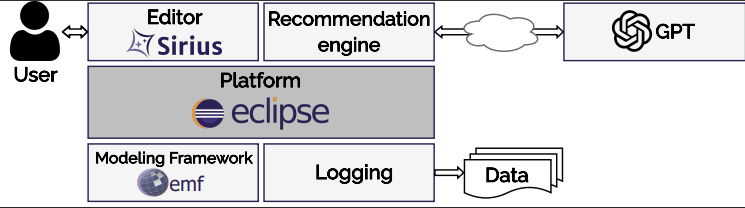

# MAGDA – Modeling Assistance with Generative Ai for Domain representation

A tool for domain modeling by class diagrams and GPT-driven recommendations.

## Setting up the environment (Developers):
  * https://www.eclipse.org/downloads/packages/release/juno/sr1/eclipse-modeling-tools
  * While running the experiment, we will have 3 workspaces running, launch the first one, import the folders in the plugin folder using "open projects from file systems"
  * launch a second instance or eclipse application from the first workspace (plugin), make sure you select a new workspace and import in that workspace the editor plugin;
  * put the key of openAI in the file config.properties.
  * launch the third workspace from the second one;
  * Create a new modeling project; import metamodel   

  
          
        

        

        
        

        
 
        
